<!-- ===================== BANNER ===================== -->
<p align="center">
  <a href="https://pankajpramanik.com">
    
  </a>
</p>

<!-- ===================== TYPING HEADLINE ===================== -->
<p align="center">
  <a href="https://git.io/typing-svg">
    
  </a>
</p>

<!-- ===================== SOCIAL STATS ===================== -->
<p align="center">
  <a href="https://github.com/pankaj2k9?tab=followers">
    
  </a>
  
  <a href="https://pankajpramanik.com">
    
  </a>
</p>

---

## 🧠  About Me

```yaml
name: Pankaj Kumar Pramanik
role: Data & AI Engineer | Workflow Automation Expert
currently:
  - 🔭 Working on freelance AI projects via Upwork
  - 🌱 Learning Big Data Engineering & Deep Learning
  - 🏗️  Building AI agents, RAG pipelines, and automated workflows
ask_me_about:
  - Generative AI, LLMs, LangChain, LangGraph, Flowise
  - RAG, AI Agents, Vector Databases
  - Python, FastAPI, Flask, Django
  - React, Next.js, Nest.js, Three.js, GSAP
links:
  portfolio: https://pankajpramanik.com
  blog:      https://aiappworld.com
  resume:    https://pankajpramanik.com/#/resume
  email:     pkp2.me2k9@gmail.com
```

---

## ✍️  Latest Blog Posts

<!-- BLOG-POST-LIST:START -->
- 📝 [Introduction to Custom Machine Learning Models](https://pankajpramanik.com/custom-machine-learning-models/)
- ⚡ [Edge Functions Best Practices: Enhancing Web Applications with CloudFront](https://pankajpramanik.com/web-applications-with-cloudfront/)
- 🔄 [Building Real-Time Web Applications with tRPC: A Comprehensive Guide](https://pankajpramanik.com/real-time-web-apps-with-trpc/)
- ⚖️  [The Ethical Risks of Artificial Intelligence in Business](https://pankajpramanik.com/ethical-risks-of-artificial-intelligence/)
- 📊 [Empowering Tomorrow: Unleashing the Potential of Big Data Solutions](https://pankajpramanik.com/potential-of-big-data-solutions/)
<!-- BLOG-POST-LIST:END -->

---

## 🌐  Connect With Me

<p align="left">
  <a href="https://linkedin.com/in/pankaj-pramanik" target="_blank">
    
  </a>
  <a href="https://twitter.com/pankajpramanikk" target="_blank">
    
  </a>
  <a href="https://kaggle.com/pankajpramanik" target="_blank">
    
  </a>
  <a href="https://www.youtube.com/@pankajpramanik3929" target="_blank">
    
  </a>
  <a href="https://www.leetcode.com/pankajpramanik" target="_blank">
    
  </a>
  <a href="https://fb.com/pankaj.pramanikk" target="_blank">
    
  </a>
  <a href="https://discord.gg/pankajpramanik" target="_blank">
    
  </a>
  <a href="https://pankajpramanik.com/latest-from-the-blog/" target="_blank">
    
  </a>
  <a href="mailto:pkp2.me2k9@gmail.com">
    
  </a>
</p>

---

## 🛠️  Tech Stack

### 🤖  AI / ML / Data
<p align="left">
  
  
  
  
  
  
  
  
  
  
  
  
  
</p>

### 💻  Languages
<p align="left">
  
  
  
  
  
  
  
  
</p>

### 🎨  Frontend
<p align="left">
  
  
  
  
  
  
  
  
  
  
  
  
</p>

### ⚙️  Backend
<p align="left">
  
  
  
  
  
  
  
</p>

### 🗄️  Databases & Messaging
<p align="left">
  
  
  
  
  
  
  
</p>

### ☁️  DevOps & Cloud
<p align="left">
  
  
  
  
  
  
</p>

### 🧪  Testing & Tools
<p align="left">
  
  
  
  
  
  
</p>

---

## 📊  GitHub Stats

<p align="center">
  
  
</p>

<p align="center">
  
  
</p>

---

<p align="center">
  
</p>

---

<p align="center">
  <em>💡 "Building intelligent systems, one agent at a time." </em><br/>
  <sub>⭐ From <a href="https://github.com/pankaj2k9">pankaj2k9</a> — Feel free to reach out for collaborations!</sub>
</p>
